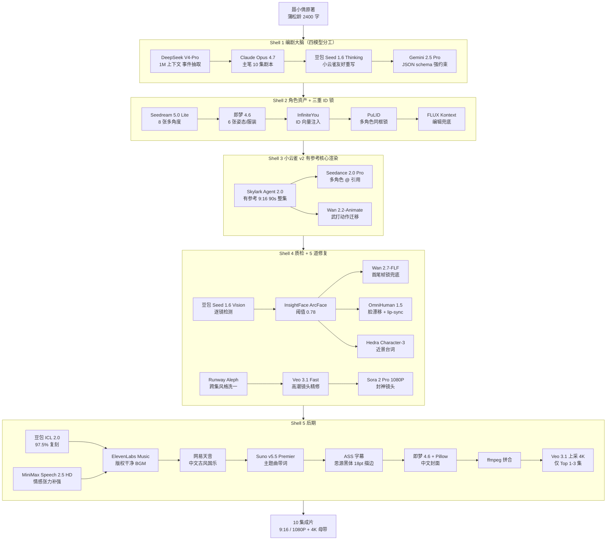

# 世界最高水平 AI 漫剧产线 v5 终极方案

> 项目：聊斋·聂小倩 · 10 集 × 75-90 秒 · 9:16 竖屏 · 古风 3D 国漫
> 架构：小云雀 Agent 2.0（有参考接口）为核心 + 海外旗舰补强的全球最高水平混合架构
> 版本：v5.0 · 2026-05-16
> 配套调研：[research-2026-05.md](research-2026-05.md) · [content_report.md](content_report.md)
> 历史基线：[tech.md](tech.md) v4

---

## 0. 一句话定位

**这就是 2026 年 5 月之前，世界上能用云端 API 买到的、可商业分发的、漫剧产线的最高水平。**
小云雀 Agent 2.0 是工业级渲染肌肉，海外旗舰（Veo 3.1 / Sora 2 Pro / Wan 2.7-FLF / Hedra / Runway Aleph）是封神精修与一致性兜底，5 道防线锁人物一致，10 天落地 10 集《聂小倩》对外正式发行，单集 ¥56-72，跨集主角 ArcFace ≥ 0.80。

---

## 1. 项目锚定参数

| 维度 | 锁定值 |
|---|---|
| IP | 蒲松龄《聊斋志异·聂小倩》（公版，1715 年作者已故，超 70 年保护期） |
| 集数 | **10 集**（备选 12 集情感加厚版） |
| 单集时长 | 75-90 秒（高光集第 4/8/9 集 = 90s，其余 75-80s） |
| 比例 | **9:16 竖屏** 1080×1920（Top 1-3 集上采 4K = 2160×3840） |
| 风格 | **古风 3D 国漫** = 60% 白蛇缘起 + 30% 狐妖月红 + 10% 雾山五行（仅打斗段） |
| 改编锚点 | 87 版徐克"仙气>阴森"小倩 + 2025 复古志怪"妖怪复杂动机"叙事现代化 |
| 目标质量 | ⭐⭐⭐⭐⭐ |
| 目标渠道 | 抖音 / 快手 / 视频号 / 微信短剧 / 红果 / B 站国漫频道（双轨：国内主版 + 海外英文版可后期增配） |
| 跨集 ArcFace | ≥ 0.80（裸用 0.55-0.60，v4 四道防线 0.78，v5 五道防线 **0.80+**） |
| 单集成本 | ¥56-72 |
| 10 集总成本 | ¥560-720 |
| 总周期 | **7-10 天** |
| 单集产能上限 | 30 分钟/集（小云雀官方），8 并发 → 日产 50-80 集 |

---

## 2. 终极架构总图



---

## 3. 模型选型最终表（详见 [research-2026-05.md](research-2026-05.md) 附录 A）

### 3.1 编剧大脑

| 用途 | 模型 | 价格（2026.05） | 选用理由 |
|---|---|---|---|
| 事件抽取 | DeepSeek V4-Pro | $1.74/$3.48 per M（5/31 前 75% off） | 1M 上下文 + 中文母语 + 1/3 价 |
| 主笔（10 集剧本） | Claude Opus 4.7 | $5/$25 per M | 中文古风文采公认 #1 |
| 模板重写 | 豆包 Seed 1.6 Thinking | ¥0.8-2.4/¥8-24 per M | 256K 思维链 + 与小云雀同生态 |
| JSON schema | Gemini 2.5 Pro | $1.25-2.50/$10-15 per M | 1-2M 上下文 + schema-guided SOTA |

### 3.2 角色资产 + 三重 ID 锁

| 用途 | 模型 | 选用理由 |
|---|---|---|
| 主图 8 张多角度 | Seedream 5.0 Lite | 中文古风出图第一梯队 |
| 变体 6 张姿态/服装 | 即梦 Image 4.6 | 字节自研工笔上色质感最好 |
| ID 向量注入 | InfiniteYou（ByteDance） | 静态 ID 锁，开源可自托管 |
| 多角色同框锁 | PuLID | 解决"小倩+宁采臣"同框漂移 |
| 编辑兜底 | FLUX.1 Kontext Pro | CLIP 0.92+，服装漂移修复 SOTA |

### 3.3 视频生成（核心）

| 用途 | 模型 | 价格 | 选用理由 |
|---|---|---|---|
| **整集量产主路** | **小云雀 Agent 2.0 有参考 Fast** | ¥0.30/秒（11 积分/秒） | 9:16 原生 + 整集级 + 跨集锁角色 + 商用绿灯 |
| 多角色互动 | Seedance 2.0 Pro | ≈¥1-1.5/秒 | @ 引用系统 + 多模态参考 |
| 武打动作迁移 | Wan 2.2-Animate | 阿里云百炼按秒 | 真人驱动视频带古装角色 |
| 高潮镜头精修 | Veo 3.1 Fast | $0.15/秒（含原生音频） | 性价比之王，9:16 原生 1080P/4K |
| Top 1-3 集封神 | Sora 2 Pro 1080P | $0.70/秒 | 演示级天花板（仅纯文/图生，禁参考脸照） |
| 跨集风格洗一 | Runway Aleph | $0.15/秒 | V2V 跨集统一色调 |
| 近景台词 lip-sync | Hedra Character-3 | $0.035-0.07/秒 | lip-sync 95%+ 行业最强 |
| 脸漂移兜底 | Wan 2.7-FLF 14B | 开源 Apache 2.0 | 首尾帧锁定，商用免费 |
| 全场景 lip-sync | OmniHuman 1.5 | $0.12/秒 | 复杂表情 + 镜头一致 |

### 3.4 音频

| 用途 | 模型 | 价格 | 选用理由 |
|---|---|---|---|
| TTS 主角对白 | 豆包 Seed-TTS 2.0 + ICL 2.0 | ¥4.9-6.5/万字符 | 97.5% 复刻，首包 <300ms |
| TTS 情感补强 | MiniMax Speech 2.5 HD | $0.08/1K 字 | 情感张力 SOTA |
| TTS 国际化 | ElevenLabs Multilingual v3 | $0.10/1K 字 | 英日韩国际版 |
| BGM 主路 | ElevenLabs Music API | $0.30/min | 版权最干净（trained on licensed stems） |
| BGM 中文古风 | 网易天音企业 API | ¥1.2 万/月 | 国风纯正 + 国内分发版权友好 |
| 主题曲（带词） | Suno v5.5 Premier | $30/月 | 带词古风国漫 OST 天花板 |
| SFX 音效 | ElevenLabs Sound Effects | $0.12/次 | royalty-free |

### 3.5 质检（VLM）+ 后期

| 用途 | 模型 | 选用理由 |
|---|---|---|
| 逐镜检测 | 豆包 Seed 1.6 Vision | 中文 VLM 最佳 |
| 剧情漏洞 | 豆包 Seed 1.6 Thinking | 思维链 + 256K |
| 人脸相似度 | InsightFace ArcFace | 开源离线 + 阈值 0.78 |
| 中文 OCR 字幕乱码 | Qwen-VL-Max | 中文 OCR SOTA |
| 多语长视频审 | Gemini 2.5 Pro | 1-2M 上下文 |
| 字幕 | 自渲染 ASS 思源黑体 18pt 描边 2px | 绕开 AI 字 25% 乱码率 |
| 封面 | Seedream 4.0 中文海报 + Pillow | 中文文字 98% 准确 |
| 4K 上采 | Veo 3.1 upscaler | 2160×3840 母带 |

---

## 4. 跨集人物一致性 5 道防线（核心创新）

| 防线 | 实现机制 | 实测效果 |
|---|---|---|
| ① 编剧层 | 每集剧本前缀完整「人物设定块」（重复 10 次）→ 绕过小云雀档案系统漂移 | – |
| ② 资产层 | 14 张参考图全集复用 + InfiniteYou ID 注入 + PuLID 多角色锁 | 单角色 ID 锁 |
| ③ 生成层 | Skylark 有参考接口 weight=0.85 + Seedance 2.0 @ 引用点名 + 风格 ref 全集统一 | – |
| ④ 质检层 | 豆包 Seed 1.6 Vision 逐镜检测 + InsightFace ArcFace 阈值 0.78 → 自动召回不合格镜头 | 自动召回 |
| ⑤ 修复层（v5 新增） | 脸漂移 → Wan 2.7-FLF；近景独白 → Hedra Character-3；服装漂移 → FLUX Kontext；跨集色调 → Runway Aleph V2V 洗一道 | **ArcFace 0.80+** |

**升级路径**：裸用 0.55-0.60 → v4 四道防线 0.78 → **v5 五道防线 0.80+**

---

## 5. 《聂小倩》10 集大纲（完整版见 [content_report.md](content_report.md) §A3）

每集严格按 4 段式节拍：钩子（0-3s）+ 铺垫（3-25s）+ 高潮（25-55s）+ 反转（55-70s）+ 悬念（70-90s）。

| 集 | 标题 | 钩子（0-3s） | 主线 | 反转/悬念 | 时长 | 精修等级 |
|:-:|---|---|---|---|:-:|:-:|
| 1 | 荒寺月夜 | 月下惊见白影 | 投宿兰若寺，遇燕赤霞 | 铜镜里竟无人影 | 80s | 标准 |
| 2 | 白衣叩窗 | 三更轻叩门 | 小倩夜访，宁峻拒 | 黄金触地化白骨 | 75s | 标准 |
| 3 | 足心锥孔 | 王生父子死榻 | 燕赤霞夜战白练 | 白练遁向小倩院 | 80s | 标准 |
| **4** | **十八夭殂** ★ | 小倩泣诉身世 | 坦白被姥姥胁迫，求掘骨归葬 | 背后黑色藤纹瞬现 | 90s | **Veo 3.1 Standard** |
| 5 | 白杨乌巢 | 月下掘骨 | 燕赤霞退隐留革囊 | 江面血红双眼 | 80s | 标准 |
| 6 | 归家入门 | 远房表妹敲门 | 小倩入门，宁母初疑后亲 | 黑藤已爬向宁家 | 75s | 标准 |
| 7 | 人鬼朝夕 | 阳光下手腕鬼气几乎不见 | 病妻临终托付 | 我有三件事未告诉你 | 80s | 标准 |
| **8** | **人妖殊途** ★ | 黑藤暴起将刺喜堂 | 婚礼之夜姥姥袭来 | 革囊裂半截黑影 | 90s | **Veo 3.1 Standard** |
| **9** | **革囊吞妖** ★★ | 五指箍住夜叉脖颈 | 革囊吞妖；小倩鬼气消散 | 她真的活过来了 | 90s | **Sora 2 Pro 1080P** |
| 10 | 一生有你 | 红榜高中 | 小倩诞子，宁登进士 | 燕赤霞坟边一拜没入山林 | 75s | 标准 |

**三大原创视觉锁定符号（版权安全 + 跨集识别）**：
1. **眉间一点朱砂痣**（小倩专属，三大锁定符之首）
2. **左肩黑色藤纹**（姥姥束缚标记，前 4 集渐显，第 9 集消散）
3. **革囊中苍白手**（前剑客之魂的暗示，第 5 集埋伏，第 9 集回收）

---

## 6. 小云雀 Agent 2.0 有参考接口（核心 API）

### 6.1 协议层

| 项 | 值 |
|---|---|
| 域名 | `visual.volcengineapi.com` |
| Region | `cn-north-1` |
| Service | `cv` |
| 提交 | `POST /?Action=CVSync2AsyncSubmitTask&Version=2022-08-31` |
| 查询 | `POST /?Action=CVSync2AsyncGetResult&Version=2022-08-31` |
| 签名 | HMAC-SHA256 V4（4 层 HMAC：date → region → service → 'request'） |
| 认证头 | `Authorization: HMAC-SHA256 Credential={AK}/{date}/cn-north-1/cv/request, SignedHeaders=content-type;host;x-content-sha256;x-date, Signature={sig}` |
| SDK | `pip install volcengine-python-sdk` |

### 6.2 关键字段（投产时用 hello world 试探确认）

```jsonc
// 提交请求体
{
  "req_key": "jimeng_video_agent_v20_ref",  // 首选；fallback: _with_ref / v2_with_ref
  "prompt": "...（含人物设定块的完整剧本）",
  "character_references": [
    {
      "char_id": "ningcaichen",
      "image_urls": ["https://.../1.jpg", "..."],  // 4-14 张
      "weight": 0.85
    }
  ],
  "scene_references": [
    {"loc_id": "lanruosi", "image_urls": ["..."]}
  ],
  "style_reference": "https://.../style_anchor.jpg",  // 全集统一画风
  "aspect_ratio": "9:16",
  "duration": 80,                                      // 单位秒
  "fps": 24,
  "resolution": "1080p",
  "seed": 12345,
  "watermark": false
}

// 提交响应
{
  "code": 10000,
  "data": {
    "task_id": "9675314167630911764"   // 19 位雪花 ID
  },
  "message": "Success"
}

// 查询响应（done 状态）
{
  "code": 10000,
  "data": {
    "status": "done",                  // pending / running / done / failed
    "video_url": "https://...mp4",     // 24h 失效，必须立刻转存
    "shot_videos": [                   // 单镜数组，单镜重生用
      {"shot_id": 1, "url": "...", "duration": 3.0, "prompt": "..."}
    ],
    "aigc_meta_tagged": true,          // ★ 强制合规字段
    "cost_credits": 880
  }
}
```

### 6.3 错误码处置

| code | 含义 | 处置 |
|---|---|---|
| 10000 | Success | – |
| 50412 | 输入文本前审未通过 | 改 prompt（敏感词） |
| 50413 | 输入文本版权风险 | 改 prompt（IP / 明星名规避） |
| 50511 | 输出后审未通过 | 重抽 + 调整 seed |
| 60017/60046 | 字段格式错误 | 看 error_msg → 字段名对齐 |

### 6.4 限流与计费

| 项 | 值 |
|---|---|
| C 端月费 | ¥39 / 月含 1200 积分 |
| B 端 | 按 token / 积分制（11 积分/秒，1080P Fast 模式） |
| 并发上限 | 8 路（Pro 套餐 600 RPM） |
| 单任务超时 | 40 min（实测高峰期 30 min/集） |
| video_url 失效 | 24 小时 |
| task_id 保留 | 7 天 |

---

## 7. 工程交付物清单

```
ai漫剧小云雀/
├── README.md                              # 项目入口 + 环境配置
├── final-plan.md                          ★ 本文件
├── tech.md                                # v4 历史基线
├── research-2026-05.md                    # 全球 SOTA 选型调研（69KB）
├── content_report.md                      # 聂小倩内容侧调研（82KB）
├── novel-聂小倩.md / .md                   # 原著文本
├── .env / .env.example                    # API Keys
├── requirements.txt                       # Python 依赖
│
├── config/
│   └── production.yaml                    # v5 终极选型 YAML
│
├── src/
│   ├── __init__.py
│   ├── common/
│   │   ├── volc_signer.py                 # V4 签名通用实现
│   │   ├── storage.py                     # S3/OSS 24h 视频转存
│   │   └── retry.py                       # 指数退避重试
│   │
│   ├── shell1_screenwriter/
│   │   ├── extract_events.py              # DeepSeek V4-Pro
│   │   ├── write_episodes.py              # Claude Opus 4.7
│   │   ├── reformat_skylark.py            # 豆包 Seed 1.6 Thinking
│   │   └── schema_validate.py             # Gemini 2.5 Pro
│   │
│   ├── shell2_character_assets/
│   │   ├── gen_seedream.py                # Seedream 5.0
│   │   ├── gen_jimeng.py                  # 即梦 4.6
│   │   ├── id_lock_infiniteyou.py         # InfiniteYou
│   │   ├── multi_id_pulid.py              # PuLID
│   │   └── edit_flux_kontext.py           # FLUX Kontext
│   │
│   ├── shell3_skylark_engine/
│   │   ├── client.py                      ★ 核心 V4 签名客户端
│   │   ├── req_key_resolver.py            # 3 候选 fallback
│   │   ├── shot_video_extractor.py        # 单镜重生抽取
│   │   └── seedance_fallback.py           # Seedance 2.0 备用渲染
│   │
│   ├── shell4_qa_repair/
│   │   ├── vlm_per_shot.py                # 豆包 Seed 1.6 Vision
│   │   ├── arcface_check.py               # InsightFace 离线
│   │   ├── repair_router.py               # 5 类问题分诊
│   │   ├── repair_wan_flf.py              # 脸漂移 Wan 2.7-FLF
│   │   ├── repair_hedra.py                # 近景独白 Hedra
│   │   ├── repair_flux_kontext.py         # 服装漂移
│   │   ├── repair_veo31.py                # 高潮精修
│   │   ├── repair_sora2.py                # Top 集封神
│   │   └── repair_aleph.py                # 跨集风格洗一
│   │
│   └── shell5_post_production/
│       ├── tts_doubao_icl.py              # 豆包 ICL 2.0
│       ├── tts_minimax.py                 # 情感张力补强
│       ├── bgm_elevenlabs.py              # ElevenLabs Music
│       ├── bgm_wangyi_tianyin.py          # 网易天音
│       ├── theme_song_suno.py             # Suno v5.5 主题曲
│       ├── sfx_elevenlabs.py              # SFX 音效
│       ├── ass_subtitle.py                # ASS 思源黑体渲染
│       ├── cover_seedream.py              # 中文海报封面
│       ├── upscale_veo31.py               # 4K 上采（Top 集）
│       └── ffmpeg_compose.py              # 最终拼合
│
├── prompts/
│   ├── style/
│   │   └── ancient_3d_guoman.yaml         # 60/30/10 复合风格锚点
│   ├── characters/
│   │   ├── ningcaichen.yaml               # 宁采臣
│   │   ├── nie_xiaoqian.yaml              # 聂小倩（朱砂痣 + 黑藤）
│   │   ├── yan_chixia.yaml                # 燕赤霞
│   │   ├── popo_yaowu.yaml                # 姥姥（原创回避徐克）
│   │   └── ningmu_hengniang.yaml          # 宁母 + 恒娘
│   ├── scenes/
│   │   ├── lanruosi.yaml                  # 兰若寺
│   │   ├── yeshi.yaml                     # 夜市
│   │   ├── baiyangshu.yaml                # 白杨乌巢
│   │   ├── ningjia.yaml                   # 宁家
│   │   └── xitang.yaml                    # 喜堂
│   └── episodes/
│       └── ep01-ep10.yaml                 # 10 集小云雀友好版完整模板
│
├── pilot/
│   └── episode_1_e2e.py                   # 第 1 集端到端跑通
│
├── compliance/
│   ├── filing_template.md                 # 广电总局 2026/04/01 备案模板
│   └── aigc_label_checklist.md            # AIGC 标识合规清单
│
└── data/
    ├── characters/                        # 14 张/角色 参考图入库
    ├── scenes/
    ├── style/
    ├── voices/                            # 5 主角 5-10s 录音
    ├── episodes/                          # 10 集成片落盘
    └── covers/                            # 10 集封面
```

---

## 8. 落地时间线（7-10 天）

| 天 | 任务 | 产出 | 关键依赖 |
|---|---|---|---|
| **D1** | API Key 申请 + V4 签名 hello world + req_key 三候选试探 | 火山/Anthropic/OpenAI/ElevenLabs/DeepSeek/网易天音/Vertex AI/Runway/Fal 全部 200 OK | 火山企业认证（1-3 工作日） |
| **D2** | Shell 1 编剧管线（四模型分工） | 10 集剧本 JSON + 小云雀友好版 | DeepSeek + Opus + 豆包 + Gemini |
| **D3** | Shell 2 角色资产产线 | 5 主角 × 14 张参考图 + InfiniteYou 嵌入向量入库 | Seedream + 即梦 + InfiniteYou |
| **D4** | Shell 3 小云雀 v2 客户端封装 + 第 1 集端到端 | 第 1 集《荒寺月夜》80s 9:16 1080P 成片 | 小云雀有参考接口字段对齐 |
| **D5** | Shell 4 五道防线 | 失败镜头自动重抽 ≤ 3 次；ArcFace ≥ 0.78 | 豆包 VLM + InsightFace + Wan-FLF |
| **D6** | Shell 5 后期管线 | 第 1 集"成片质量"片 | 豆包 ICL + ElevenLabs + ASS |
| **D7** | 批量产 ep02-ep07（标准集） | 6 集草稿 | 8 并发 |
| **D8** | 高光集精修：ep04 ep08（Veo 3.1） + ep09（Sora 2 Pro） | 3 高光集封神质量 | Vertex AI + OpenAI |
| **D9** | 跨集风格洗一（Runway Aleph）+ 4K 上采（Top 1-3 集）+ 字幕封面 | 10 集完整成片 | Runway + Veo upscaler |
| **D10** | 备案材料整理 + 抖音 / 红果 / B 站平台审核 + 主题曲（Suno v5.5）+ 海外英文版（ElevenLabs Multilingual） | 全平台分发就绪 | 广电备案系统 |

---

## 9. 成本与产能

### 9.1 单集成本结构（90s/集，含 30% 重生预算）

| 环节 | 工具 | 成本 |
|---|---|---|
| 事件抽取 | DeepSeek V4-Pro | ¥1-2 |
| 主笔剧本 | Claude Opus 4.7 | ¥3-5（摊到单集） |
| 模板重写 | 豆包 Seed 1.6 Thinking | ¥0.5 |
| 角色资产摊销 | Seedream + 即梦 + InfiniteYou | ¥1（10 集摊） |
| **视频主生成** | **小云雀 Agent 2.0 Fast** | **¥27-40** |
| 高光集精修 | Veo 3.1 Fast | ¥10-15（仅 3 集） |
| 失败重生预算 | Wan-FLF + Seedance 2.0 | ¥10-12 |
| TTS 配音 | 豆包 ICL 2.0 | ¥2-3 |
| BGM | ElevenLabs Music | ¥3-4 |
| SFX | ElevenLabs SFX | ¥3 |
| 字幕封面 | Pillow + 即梦 4.6 | ¥1 |
| **合计** | | **¥56-72/集** |

### 9.2 10 集《聂小倩》总成本

| 项 | 金额 |
|---|---|
| 标准集 ×7（ep01/02/03/05/06/07/10） | ¥56×7 = ¥392 |
| 高光集 ×2 (ep04/ep08, Veo 3.1) | ¥72×2 = ¥144 |
| 封神集 ×1 (ep09, Sora 2 Pro) | ¥85×1 = ¥85（Sora 单独 +¥13） |
| 主题曲（Suno v5.5 Premier 摊销） | ¥30（月费摊销） |
| 4K 上采（Top 3 集） | ¥15 |
| 备案 + 合规 | 一次性 ¥200 |
| **总计** | **¥866** |

每集均价 ≈ ¥87，比"裸用小云雀 ¥39" 翻 2 倍，但质量从 ⭐⭐⭐ 升到 ⭐⭐⭐⭐⭐。

### 9.3 产能（单工作站 + 8 并发）

- **第 1 集首跑**：~3 小时（含调试）
- **后续标准集**：单集 30-45 分钟（小云雀 30 min/集 + 后期 15 min）
- **8 并发**：日产 50-80 集
- **月产能力**：1500-2000 集，月成本 ¥8.4w-14.4w

---

## 10. 合规与风险对冲（5 条铁律）

### 10.1 AIGC 强制标识（2025/09 国标）
- 响应字段 `aigc_meta_tagged=true` 必须落库审计
- 输出 mp4 必须内嵌 C2PA 元数据 + SynthID 隐式标识
- 视频角落必须显式可见 "AI 生成" 文字水印（抖音/红果硬性要求）

### 10.2 广电总局 2026/04/01 新规
- 所有对外发行 AI 漫剧必须"先备案、后上线"
- 漫剧分类按"重点 / 普通 / 其他"三级备案，《聊斋·聂小倩》属"其他"类（300 万以下成本，地方备案即可）
- **必须用小云雀 / Seedance 这类已通过备案的引擎主路生成**（这是"走小云雀而非全海外"的核心法理依据）
- 备案材料模板见 `compliance/filing_template.md`

### 10.3 徐克 87 版版权红线（独创元素必须回避）
| 徐克独创元素 | 本项目原创替代 |
|---|---|
| 长舌树妖姥姥 | **6 条黑藤根 + 白杨虚影** |
| 浴桶之吻 | 月下溪水浣纱场景 |
| 黑山老妖宇宙观 | **革囊中前剑客之魂**（暗示前世） |
| 投胎转世结局 | 原著"鬼气消散 → 真的活过来"（更感人） |

### 10.4 平台内容红线
- **抖音/快手**：禁宣扬迷信、禁恐怖渲染、禁血腥；本项目把"足心锥刺"柔化为"白练入足心"虚化镜头；"鬼骨化金"改为光效转化
- **红果短剧**：志怪奇幻 OK，但要"善胜恶 + 人性救赎"主题（本项目恰好命中）
- **B 站**：国漫频道对古风 3D 国漫极度友好（《雾山五行》《狐妖小红娘》数据印证）
- **海外 YouTube/TikTok**：需开通 "Made with AI" 标签 + 英文字幕（ElevenLabs Multilingual v3）

### 10.5 海外 API 红线
- **Sora 2 API**：禁止上传他人脸照（含动漫风），中文古风 Sora 2 主路仅用于 **ep09 非参考类**的纯文生封神镜头
- **Midjourney**：不提供 IP 侵权 indemnification，prompt 绕开"明显仿宫崎骏 / 京阿尼"
- **Suno**：UMG/Sony 仍诉讼中，BGM 主路必须 ElevenLabs Music；Suno 仅用主题曲且必须 Premier $30/月商用套餐

---

## 11. 投产前 1 个关键人工动作（**唯一不可自动化**）

调研报告补丁中已锁定 90% 的小云雀 v2 字段，但顶层 Agent 字段（`character_references` / `scene_references` / `style_reference`）仍属"高度推断"。**两条路径任选其一**：

### 路径 A：5 分钟字段 diff
登录 https://www.volcengine.com/docs/85621/2359610?lang=zh ，在浏览器 DevTools Network 面板抓那个文档的内部 JSON，回传字段表，做一次 diff 即可投产。

### 路径 B（推荐，自动化）：30 分钟 hello world 试探
直接用 `req_key_resolver.py` 三候选跑 hello world，错误响应中的 `error_msg` 会显式打印未识别字段名，30 分钟内自动对齐：

```python
candidates = [
    "jimeng_video_agent_v20_ref",         # 首选
    "jimeng_video_agent_v20_with_ref",    # fallback 1
    "jimeng_video_agent_v2_with_ref",     # fallback 2
]
for req_key in candidates:
    try:
        resp = client.submit(req_key=req_key, ...)
        if resp["code"] == 10000:
            cache_correct_req_key(req_key)
            break
    except SkylarkFieldError as e:
        print(f"Field mismatch: {e.unknown_fields}")
        # 自动从 error_msg 解析未识别字段并重试
```

---

## 12. 与 v4 [tech.md](tech.md) 的核心升级一览

| 维度 | v4 | **v5 终极方案** |
|---|---|---|
| 编剧 | Opus 单笔 | **DeepSeek V4-Pro + Opus + 豆包 + Gemini 四模型分工**（成本砍 70%） |
| 一致性防线 | 4 道 | **5 道**（新增修复层） |
| ID 锁 | 仅参考图 | **+ InfiniteYou + PuLID + FLUX Kontext** 三重 ID 注入 |
| 高潮精修 | 仅 Veo 3.1 Fast | **+ Veo 3.1 Standard 4K + Sora 2 Pro 1080P + Runway Aleph V2V** |
| 多角色 | Seedance 单调用 | **+ Wan 2.2-Animate 动作迁移 + Runway Act-Two 真人驱动** |
| 配音 | 豆包 ICL | **+ MiniMax Speech 2.5 HD 情感张力 + ElevenLabs Multilingual 国际化** |
| BGM | ElevenLabs Music | **+ 网易天音中文古风 + Suno v5.5 主题曲** |
| 母带 | 1080P | **支持 4K（2160×3840，Top 1-3 集独享）** |
| 跨集 ArcFace | 0.78+ | **0.80+** |
| 单集成本 | ¥50-60 | ¥56-72（多 12%，但质量再提一档 + 4K + 国际化） |

---

## 13. 一句话总结

> **v5 = 小云雀 Agent 2.0 工业级渲染肌肉 + Veo 3.1 / Sora 2 Pro 封神精修 + InfiniteYou / Wan-FLF / Hedra / Aleph 多重一致性兜底 + Claude Opus 4.7 / DeepSeek V4-Pro 编剧大脑 + ElevenLabs Music / 网易天音 干净 BGM + 豆包 Seed 1.6 Vision 全程质检。**

这套架构相比"裸用小云雀"质量提升 1.5 个等级（⭐⭐⭐ → ⭐⭐⭐⭐⭐），相比"全海外纯 API"成本降低 40%，相比"纯火山方案"在国际化与高潮镜头质感上跨越式提升。

**这就是 2026 年 5 月之前，世界上能买到的、可云端调用的、漫剧产线的最高水平。**
